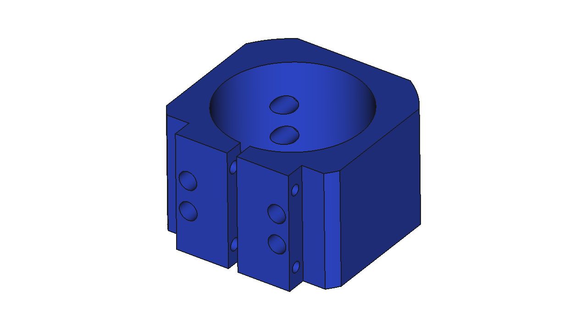
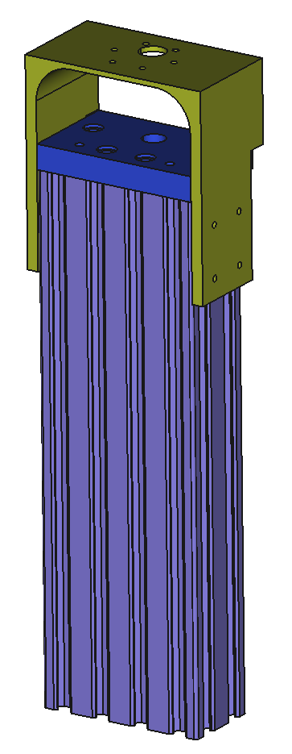
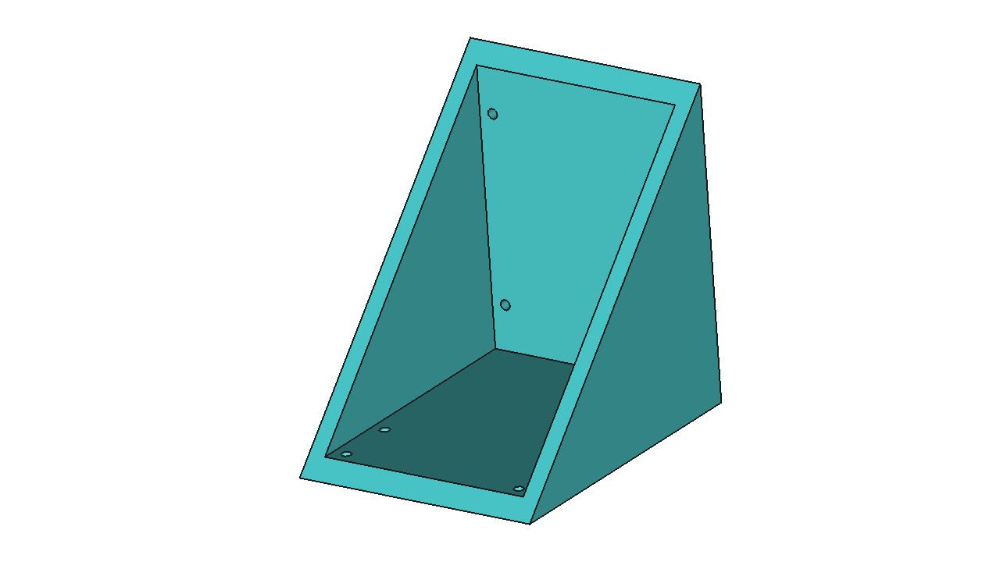

### This repo details my efforts towards improving the Z-axis of a [Maslow CNC Machine](https://www.maslowcnc.com/)

I purchased my Maslow kit from [MAKER MADE](https://makermade.com/).  This is what the original z-axis looks like.  It uses the manual height adjustment mechanism of the router holder for moving the bit in and out of the wood.

I decided to use the OPENBUILDS [250mm C-Beam Linear Actuator](https://openbuildspartstore.com/c-beam-linear-actuator-bundle/) as the basis for the new Z-axis.  There is no need to purchase the stepper motor as it will not work with the Maslow.

Here is what the new z-axis looks like.  A 500[mm] long actuator was intially used because there were not any 250[mm] models available.

#### Pros
* router moves repeatably and accurately in the z-direction
* router no longer shifts in the x and y-directions when moving in the z-direction
* router now moves about 2.5x faster in the z-direction

#### Cons
* cost ~$150
* initial alignment
* dust collection

Below are the three main pieces that need to be 3D printed.  
 
**Router Clamp** - this connects the Rigid R2911 router to the carriage of the linear actuator

**Motor Mount** - this connects the existing Z-axis motor to the linear actuator 

**Brace** - this helps keep the z-axis perpendicular to the board 

One will also need to print about 20 of these [M3 T-nuts](https://www.thingiverse.com/thing:1064782).  The M3 T-nut STL is included in this repo for completeness.

The CAD data supplied can be opened with [FreeCAD V0.19](https://www.freecadweb.org/) and the fantastic [Assembly 4 Workbench](https://github.com/Zolko-123/FreeCAD_Assembly4).

#### Notes:
* The shaft coupler supplied with the actuator kit will work with the Z-axis motor
* Effective pitch of the new lead screw is 8[mm] (2mm pitch x 4 starts)
* I use [WebControl](https://github.com/WebControlCNC/WebControl) and calibrate via the ['holey calibration'](https://webcontrolcnc.github.io/WebControl/Actions/Calibration-Setup/holeyCalibration.html) method

#### To do:
* Add dust collection panels
* trim actuator to more reasonable length (TBD)
