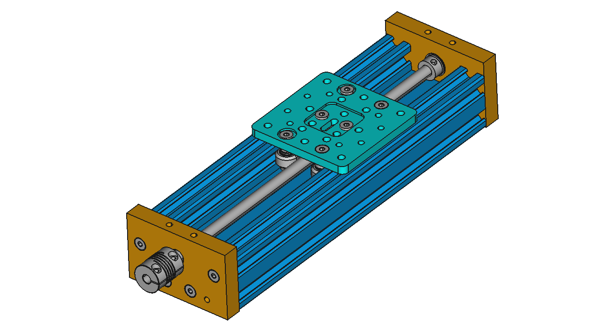
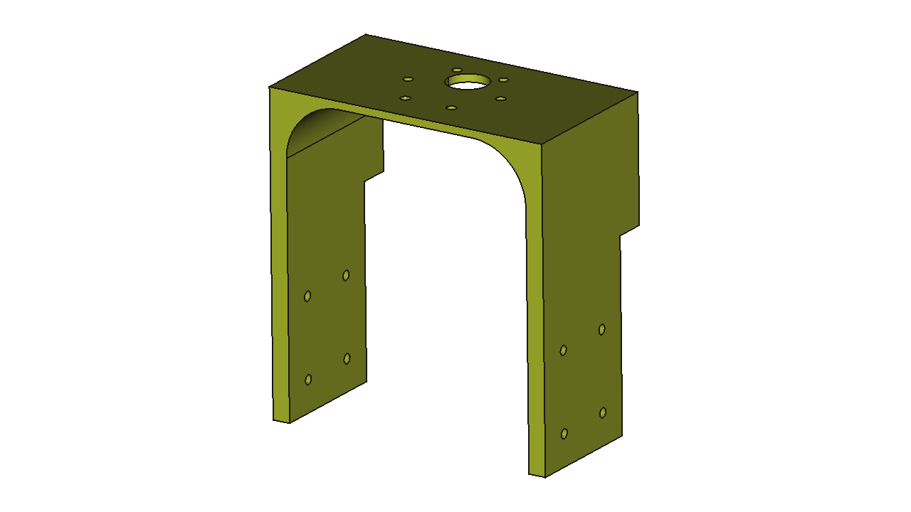

### This repo details my efforts towards improving the Z-axis of a [Maslow CNC Machine](https://www.maslowcnc.com/)

I purchased my Maslow kit from [MAKER MADE](https://makermade.com/).  

I decided to use the OPENBUILDS [250mm C-Beam Linear Actuator](https://openbuildspartstore.com/c-beam-linear-actuator-bundle/) as the basis for my Z-axis.  There is no need to purchase the stepper motor as it will not work with the Maslow.

#### Pros
* router moves repeatably and accurately in the Z-direction
* router doesn't shift in the x and y-directions when moving in the z-direction
* router moves faster in the z-direction

#### Cons
* cost ~$150
* alignment
* dust collection

Below are the three main pieces that need to be 3D printed.  
 
**Router Clamp** - this connects the Rigid R2911 router to the carriage of the linear actuator

**Motor Mount** - this connects the existing Z-axis motor to the linear actuator 

**Brace** - this helps keep the z-axis perpendicular to the board 

One will also need to print about 10 of these [M3 T-nuts](https://www.thingiverse.com/thing:1064782).  The M3 T-nut STL is included in this repo for completeness.

The CAD data supplied can be opened with [FreeCAD V0.19](https://www.freecadweb.org/) and the fantastic [Assembly 4 Workbench](https://github.com/Zolko-123/FreeCAD_Assembly4).

#### Notes:
* The shaft coupler supplied with the actuator kit will work with the Z-axis motor
* Effective pitch of the new lead screw is 8[mm] (2mm pitch x 4 starts)

#### To do:
* Add dust collection panels
* trim actuator to more reasonable length (TBD)
